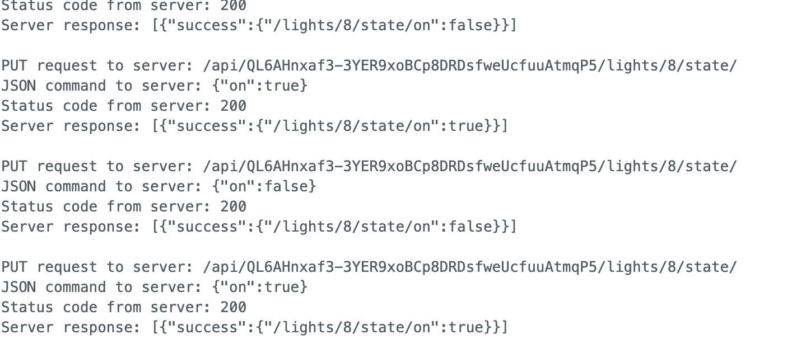

# hue-controller

Resources
https://www.tigoe.com/pcomp/code/controllers/real-time-systems-and-operating-systems/ Rotary Encoders

https://itp.nyu.edu/physcomp/labs/lab-using-a-rotary-encoder/

Code examples
Arduino HTTP Client Hue Blink Example [https://github.com/arduino-libraries/ArduinoHttpClient/blob/master/examples/HueBlink/HueBlink.ino]

Turned light 8 on and off through Arduino ✔️

